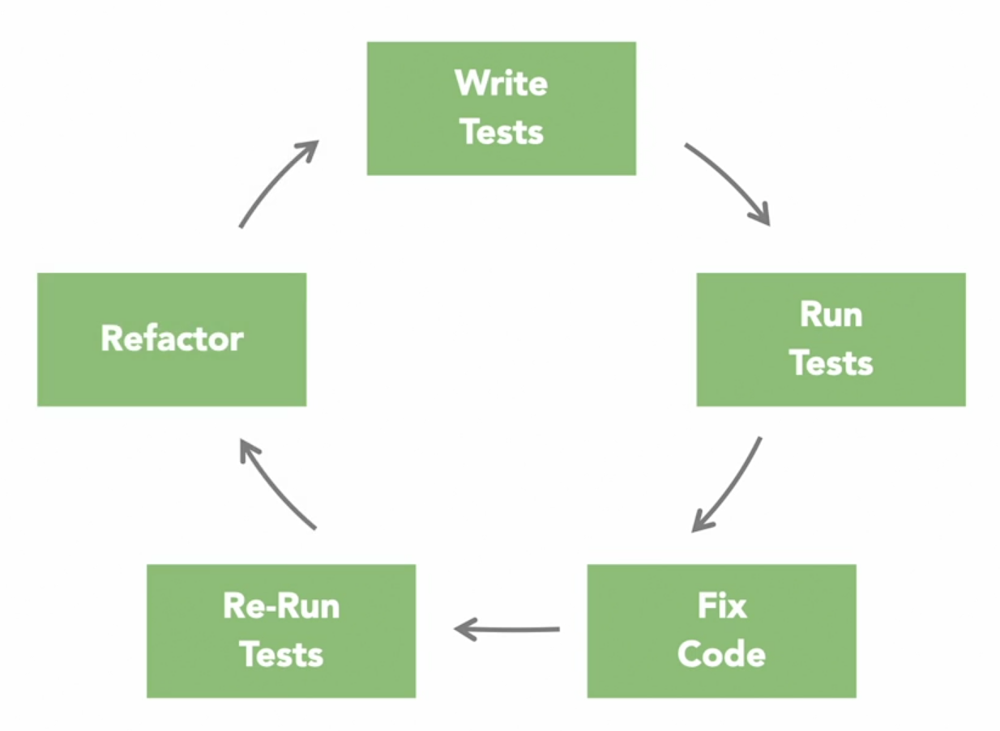

# Test-Driven Development

 

### Terminologia de Testes

- **Teste unitário**
- **Teste Red/green**
- **Sistema sob teste (SUT)**
- **Organizar, agir, afirmar (AAA: Arrange, Act, Assert)**
- **Cobertura de código**

### Vantagens do TDD

- Código mais confiável e com menos bugs
- Design mais limpo e desacoplado
- Testes pequenos → aplicações modulares
- Facilita refatorações
- Refatoração precoce, não tardia
- Testes automatizados
- Documentação viva

## Ferramentas de Teste e Bibliotecas de Mock

### **Frameworks de Teste**
- MSTest
- NUnit
- xUnit

### **Bibliotecas de Mock**
- Moq
- NSubstitute
- FakeItEasy
- Microsoft Fakes

